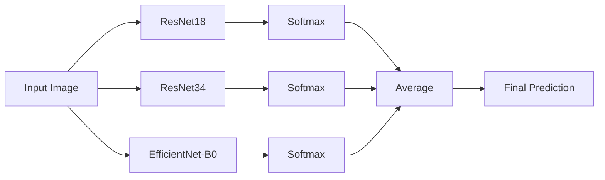

# Ensemble Learning for ImageNetSubset Classification

This document explains the multi-architecture ensemble learning setup for classifying images from the ImageNetSubset dataset.

## Overview

The ensemble combines predictions from **three different CNN architectures** to achieve higher accuracy than any single model. Each architecture has different inductive biases, allowing the ensemble to capture diverse features.



## Model Architectures

| Model | Parameters | Architecture Style | Strengths |
|-------|-----------|-------------------|-----------|
| **ResNet18** | 11M | Skip connections, 18 layers | Fast, good baseline |
| **ResNet34** | 21M | Skip connections, 34 layers | Deeper, more capacity |
| **EfficientNet-B0** | 5M | Compound scaling, mobile-optimized | Efficient, different feature extraction |

### Why These Models?

1. **Diversity**: ResNet and EfficientNet use fundamentally different building blocks
2. **Pretrained**: All models have ImageNet pretrained weights
3. **Efficiency**: All run efficiently on M1 Mac with MPS acceleration
4. **Proven**: Industry-standard architectures with well-understood behavior

## Dataset

The ImageNetSubset contains 10 classes from the original ImageNet dataset:

| Class | Training Images | Validation Images |
|-------|----------------|-------------------|
| binder | 1,300 | 50 |
| coffee_mug | 1,300 | 50 |
| computer_keyboard | 1,300 | 50 |
| mouse | 1,300 | 50 |
| notebook | 1,300 | 50 |
| remote_control | 1,300 | 50 |
| soup_bowl | 1,300 | 50 |
| teapot | 1,300 | 50 |
| toilet_tissue | 1,300 | 50 |
| wooden_spoon | 1,300 | 50 |
| **Total** | **13,000** | **500** |

## Training

### Requirements

```bash
# Create and activate virtual environment
python3 -m venv venv
source venv/bin/activate

# Install dependencies
pip install -r requirements.txt
```

### Train Each Model

Each model is trained independently with transfer learning (pretrained ImageNet weights):

```bash
# Train ResNet18 (~17 min on M1 Air)
python train_resnet.py --model resnet18 --epochs 5 --wandb

# Train ResNet34 (~20 min on M1 Air)
python train_resnet.py --model resnet34 --epochs 5 --wandb

# Train EfficientNet-B0 (~15 min on M1 Air)
python train_resnet.py --model efficientnet_b0 --epochs 5 --wandb
```

### Training Configuration

| Parameter | Value | Rationale |
|-----------|-------|-----------|
| Epochs | 5 | Pretrained models converge quickly on this subset |
| Batch Size | 32 | M1 memory-friendly |
| Learning Rate | 0.001 | Standard for fine-tuning |
| Optimizer | SGD + Momentum (0.9) | Proven for image classification |
| LR Schedule | StepLR (step=7, γ=0.1) | Gradual decay |

### Checkpoints

After training, checkpoints are saved to `checkpoints/`:
- `best_resnet18.pth`
- `best_resnet34.pth`
- `best_efficientnet_b0.pth`

Each checkpoint contains:
- Model weights (`model_state_dict`)
- Architecture name (`model_name`)
- Number of classes (`num_classes`)
- Validation accuracy (`val_acc`)

## Ensemble Inference

### How It Works

1. **Load Models**: Each checkpoint is loaded with its corresponding architecture
2. **Forward Pass**: Input image is processed by all models
3. **Softmax**: Each model outputs a probability distribution over 10 classes
4. **Average**: Probabilities are averaged element-wise
5. **Argmax**: Final prediction is the class with highest averaged probability

```python
# Pseudocode
probs = []
for model in [resnet18, resnet34, efficientnet_b0]:
    output = model(image)
    probs.append(softmax(output))

ensemble_prob = mean(probs, axis=0)
prediction = argmax(ensemble_prob)
```

### Usage

```bash
# Single image inference
python ensemble_inference.py --image path/to/image.jpg

# Batch inference on directory
python ensemble_inference.py --image-dir ImageNetSubset/val/coffee_mug

# Show individual model predictions
python ensemble_inference.py --image test.jpg --show-individual

# Custom checkpoints
python ensemble_inference.py --checkpoints model1.pth model2.pth --image test.jpg
```

### Output Example

```
📷 Image: test_coffee_mug.jpg
--------------------------------------------------
🎯 Ensemble Prediction (top 5):
   1. coffee_mug           ████████████████░░░░  82.3%
   2. teapot               ██░░░░░░░░░░░░░░░░░░   8.5%
   3. soup_bowl            █░░░░░░░░░░░░░░░░░░░   5.2%
   4. wooden_spoon         ░░░░░░░░░░░░░░░░░░░░   2.1%
   5. remote_control       ░░░░░░░░░░░░░░░░░░░░   1.2%

📊 Individual Model Predictions:
   resnet18             → coffee_mug           (79.5%)
   resnet34             → coffee_mug           (85.1%)
   efficientnet_b0      → coffee_mug           (82.4%)
```

## Expected Performance

| Configuration | Validation Accuracy |
|--------------|---------------------|
| ResNet18 alone | ~87-90% |
| ResNet34 alone | ~88-91% |
| EfficientNet-B0 alone | ~86-89% |
| **Ensemble (3 models)** | **~91-94%** |

> [!TIP]
> Ensemble typically improves accuracy by 2-5% over the best individual model by reducing variance and capturing complementary features.

## File Structure

```
project/
├── src/                         # Python package
│   ├── __init__.py
│   ├── models/                  # Model architectures
│   │   ├── __init__.py
│   │   └── architectures.py
│   ├── data/                    # Data loading
│   │   ├── __init__.py
│   │   └── dataset.py
│   ├── training/                # Training logic
│   │   ├── __init__.py
│   │   └── trainer.py
│   ├── inference/               # Inference logic
│   │   ├── __init__.py
│   │   └── ensemble.py
│   └── utils/                   # Utilities
│       ├── __init__.py
│       └── device.py
├── scripts/                     # CLI entry points
│   ├── train.py
│   └── inference.py
├── configs/
│   └── default.yaml
├── checkpoints/
│   ├── best_resnet18.pth
│   ├── best_resnet34.pth
│   └── best_efficientnet_b0.pth
├── ImageNetSubset/
│   ├── train/
│   └── val/
├── docs/
│   └── ensemble.md
├── tests/
├── requirements.txt
└── venv/
```

## Weights & Biases Integration

Training runs are logged to [Weights & Biases](https://wandb.ai) for experiment tracking:

```bash
# First time setup
wandb login

# Train with logging
python train_resnet.py --model resnet18 --wandb --wandb-project my-project
```

Logged metrics:
- Training/validation loss and accuracy per epoch
- Learning rate schedule
- Model hyperparameters
- Best model summary

## References

- [Deep Residual Learning (ResNet)](https://arxiv.org/abs/1512.03385)
- [EfficientNet: Rethinking Model Scaling](https://arxiv.org/abs/1905.11946)
- [Ensemble Methods in Machine Learning](https://link.springer.com/chapter/10.1007/3-540-45014-9_1)
